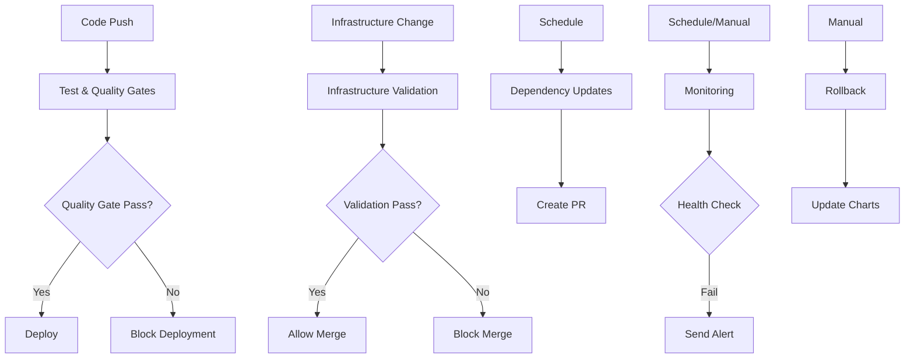

# GitOps CI/CD Workflows

This directory contains GitHub Actions workflows for the retail store application's GitOps pipeline.

## 🔄 Workflows Overview

### 1. **Deploy** (`deploy.yml`)
**Trigger:** Push to `gitops` branch in `src/` directory, Manual dispatch
**Purpose:** Main deployment pipeline

**Features:**
- 🔍 Smart change detection (builds only modified services)
- 🐳 Automated Docker builds and ECR pushes
- 📝 Helm chart updates with commit-based tags
- 🔄 Automatic commits back to repository
- 🎯 Manual deployment with service selection
- 🌍 Environment targeting (production/staging)

**Manual Trigger Options:**
- `services`: Comma-separated list or "all" (default: all)
- `environment`: Target environment (default: production)

### 2. **Test & Quality Gates** (`test.yml`)
**Trigger:** Push/PR to `gitops` branch in `src/` directory
**Purpose:** Automated testing and quality assurance

**Features:**
- 🧪 Language-specific test execution (Java/Go/Node.js)
- 🔒 Security vulnerability scanning with Trivy
- 🔨 Docker build validation
- ✅ Quality gate enforcement
- 📊 SARIF security report uploads

### 3. **Infrastructure Validation** (`infrastructure.yml`)
**Trigger:** Push/PR to `gitops` branch in `terraform/` or `argocd/` directories
**Purpose:** Infrastructure and configuration validation

**Features:**
- 🏗️ Terraform format, validation, and planning
- ⚓ Helm chart linting and templating
- 🔄 ArgoCD application validation
- 🔒 Infrastructure security scanning with Checkov
- 📋 Kubernetes manifest validation

### 4. **Rollback** (`rollback.yml`)
**Trigger:** Manual dispatch only
**Purpose:** Safe rollback to previous versions

**Features:**
- 🔄 Single service or all services rollback
- ✅ Commit and image validation
- 🐳 ECR image existence verification
- 📝 Automated Helm chart updates
- 🎯 Environment-specific rollbacks

**Manual Trigger Options:**
- `service`: Target service or "all"
- `commit_hash`: 7-character commit hash to rollback to
- `environment`: Target environment

### 5. **Dependency Updates** (`dependency-update.yml`)
**Trigger:** Weekly schedule (Sundays 2 AM UTC), Manual dispatch
**Purpose:** Automated dependency management

**Features:**
- ☕ Java Maven dependency updates
- 🐹 Go module updates
- 📦 Node.js package updates
- 🧪 Automated testing of updates
- 📝 Automatic PR creation for reviews

### 6. **Monitoring & Health Checks** (`monitoring.yml`)
**Trigger:** Every 15 minutes, Manual dispatch
**Purpose:** Continuous application monitoring

**Features:**
- 🔄 ArgoCD application health monitoring
- 🐳 Pod readiness and status checks
- 🌐 Endpoint availability testing
- 📊 Comprehensive health reporting
- 🚨 Slack notifications on failures

## 🔧 Setup Requirements

### GitHub Secrets
Configure these secrets in your repository settings:

| Secret | Description | Example |
|--------|-------------|---------|
| `AWS_ACCESS_KEY_ID` | AWS Access Key | `AKIA...` |
| `AWS_SECRET_ACCESS_KEY` | AWS Secret Key | `wJalrXUt...` |
| `AWS_REGION` | AWS Region | `us-west-2` |
| `AWS_ACCOUNT_ID` | AWS Account ID | `123456789012` |
| `SLACK_WEBHOOK_URL` | Slack webhook for alerts | `https://hooks.slack.com/...` |

### IAM Permissions
The AWS credentials need these permissions:
```json
{
  "Version": "2012-10-17",
  "Statement": [
    {
      "Effect": "Allow",
      "Action": [
        "ecr:*",
        "eks:DescribeCluster",
        "eks:UpdateKubeconfig"
      ],
      "Resource": "*"
    }
  ]
}
```

## 🚀 Usage Examples

### Deploy Specific Services
```bash
# Via GitHub UI: Actions → Deploy → Run workflow
# Services: ui,catalog
# Environment: production
```

### Rollback a Service
```bash
# Via GitHub UI: Actions → Rollback → Run workflow
# Service: ui
# Commit Hash: abc1234
# Environment: production
```

### Manual Health Check
```bash
# Via GitHub UI: Actions → Monitoring & Health Checks → Run workflow
# Environment: production
```

## 📊 Workflow Dependencies



## 🔍 Monitoring & Alerting

### Health Check Metrics
- **ArgoCD Applications:** Sync and health status
- **Pod Status:** Ready/Total pod counts
- **Endpoint Availability:** HTTP response validation
- **Resource Usage:** CPU/Memory utilization (future)

### Alert Conditions
- ArgoCD application not synced or unhealthy
- Pods not ready or crashing
- Service endpoints not responding
- Deployment failures
- Security vulnerabilities detected

## 🛠️ Troubleshooting

### Common Issues

**1. ECR Permission Denied**
```bash
# Check IAM permissions for ECR access
aws ecr describe-repositories --region us-west-2
```

**2. ArgoCD Application Not Syncing**
```bash
# Check application status
kubectl get application -n argocd
kubectl describe application retail-store-ui -n argocd
```

**3. Pod Not Starting**
```bash
# Check pod logs and events
kubectl logs -l app.kubernetes.io/name=ui
kubectl get events --sort-by='.lastTimestamp'
```

**4. Workflow Not Triggering**
- Ensure changes are in correct paths (`src/` for deploy)
- Check branch name is `gitops`
- Verify GitHub Actions is enabled

### Debug Commands
```bash
# Check EKS cluster access
aws eks update-kubeconfig --region us-west-2 --name retail-store

# Verify ArgoCD installation
kubectl get pods -n argocd

# Check service status
kubectl get services -o wide

# View recent deployments
kubectl get deployments -o wide
```

## 📈 Best Practices

### Development Workflow
1. **Feature Development:** Work on feature branches
2. **Testing:** Ensure tests pass locally
3. **PR Review:** Create PR to `gitops` branch
4. **Quality Gates:** Let automated tests run
5. **Deployment:** Merge triggers automatic deployment
6. **Monitoring:** Watch health checks post-deployment

### Security
- 🔒 Use least-privilege IAM roles
- 🔄 Rotate AWS credentials regularly
- 🔍 Review security scan results
- 📝 Enable branch protection rules
- 🚨 Monitor for security alerts

### Performance
- 🎯 Deploy only changed services
- 📊 Monitor resource usage
- 🔄 Use appropriate resource limits
- 📈 Scale based on metrics

---

This GitOps pipeline provides a robust, automated, and secure deployment workflow for the retail store microservices application.